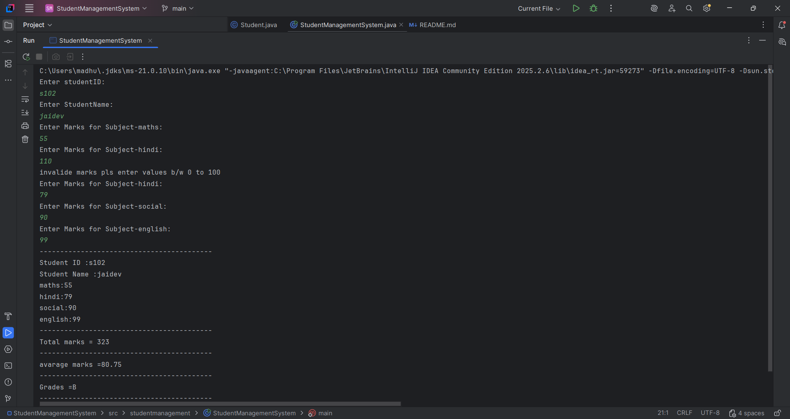

# Student Management System

## Project Overview

This project is a Java-based console application that demonstrates core Java programming concepts through a practical and simple real-world use case. The program allows a user to enter student details, input marks for different subjects, validate the marks, calculate the total and average marks, determine the grade, and display the final result.

The application is designed to strengthen understanding of variables, operators, control statements, arrays, strings, methods, and input validation in Java.

## Objectives

The main purpose of this project is to:
- practice Java fundamentals in a real application
- implement user input handling with the Scanner class
- use arrays to store subject names and marks
- apply conditional logic for grade calculation
- build modular code using separate classes and methods
- demonstrate input validation and error handling

## Features

- Enter student ID and student name
- Store marks for four subjects: Maths, Hindi, Social Studies, and English
- Validate marks to ensure values are between 0 and 100
- Calculate total marks
- Calculate average marks
- Determine the grade based on the average
- Display the student information and result in the console

## Grade Criteria

The grade is calculated using the average marks:

- 90 and above: A
- 75 to 89: B
- 60 to 74: C
- 50 to 59: D
- Below 50: F

## Project Structure

```text
StudentManagementSystem/
├── src/
│   └── studentmanagement/
│       ├── Student.java
│       └── StudentManagementSystem.java
├── README.md
└── StudentManagementSystem.iml
```

## Classes

### Student

This class represents a single student and stores:

- student ID
- student name
- subject names
- marks

It also contains methods to:

- display student details
- calculate total marks
- calculate average
- calculate grade

### StudentManagementSystem

This is the main class that contains the program logic. It:

- takes user input
- validates marks
- creates a Student object
- prints the final report

## How the Application Works

1. The program starts and asks for the student ID.
2. It asks for the student name.
3. It prompts the user to enter marks for each subject.
4. If a mark is invalid, the program prints a message and asks again.
5. Once all values are entered, it creates a Student object.
6. The program displays:
   - student ID
   - student name
   - subject-wise marks
   - total marks
   - average marks
   - grade

## Test Cases

### Test Case 1: Valid marks
The user enters marks within the allowed range for all four subjects: Maths (33), Hindi (55), Social Studies (66), and English (77). The application accepts the values and displays a total of 231, an average of 57.75, and grade D.


### Test Case 2: Invalid mark is rejected
The user enters 110 for Hindi, which is above the allowed maximum of 100. The application displays an error and asks for that subject's mark again. After the user enters 79, it accepts the marks and displays a total of 323, an average of 80.75, and grade B.



## Requirements

To run this project, you need:

- Java Development Kit (JDK) 8 or above
- A Java IDE such as VS Code, IntelliJ IDEA, or Eclipse
- Command-line terminal or IDE run support

## How to Run

Open the project folder in a terminal and run the following commands:

```bash
javac src/studentmanagement/*.java
java -cp src studentmanagement.StudentManagementSystem
```

## Sample Output

```text
Student Management System
Enter studentID:
S101
Enter StudentName:
John
Enter Marks for Subject-maths:
85
Enter Marks for Subject-hindi:
90
Enter Marks for Subject-social:
78
Enter Marks for Subject-english:
80
------------------------------------------
Student ID :S101
Student Name :John
maths:85
hindi:90
social:78
english:80
------------------------------------------
Total marks = 333
------------------------------------------
avarage marks =83.25
------------------------------------------
Grades =B
------------------------------------------
```

## Learning Outcomes

This project helps learners understand how to:

- write structured Java programs
- use arrays and loops effectively
- implement validation checks
- create reusable methods
- organize project code into classes and packages

## Conclusion

This Student Management System is a beginner-friendly Java project that applies fundamental programming concepts to a useful real-world scenario. It is a great example of how simple Java programs can be designed to manage student records and compute academic results efficiently.
